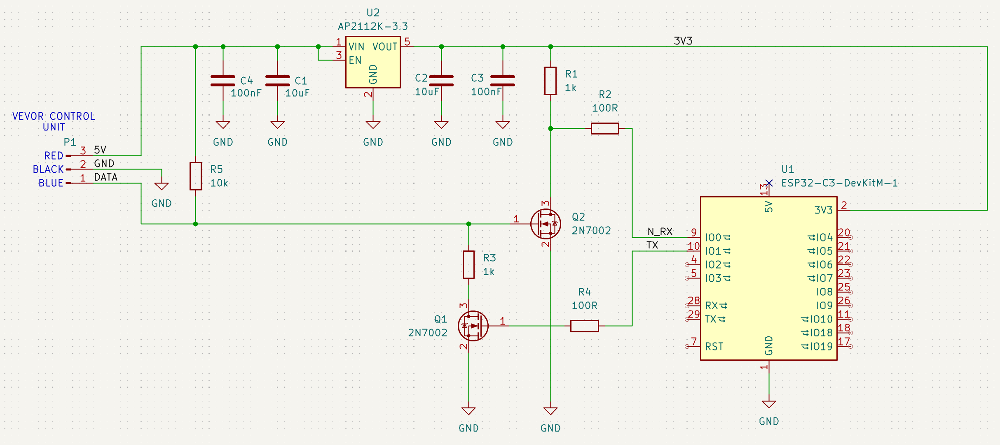
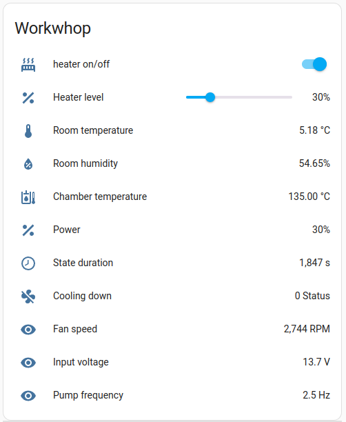
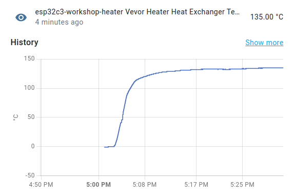
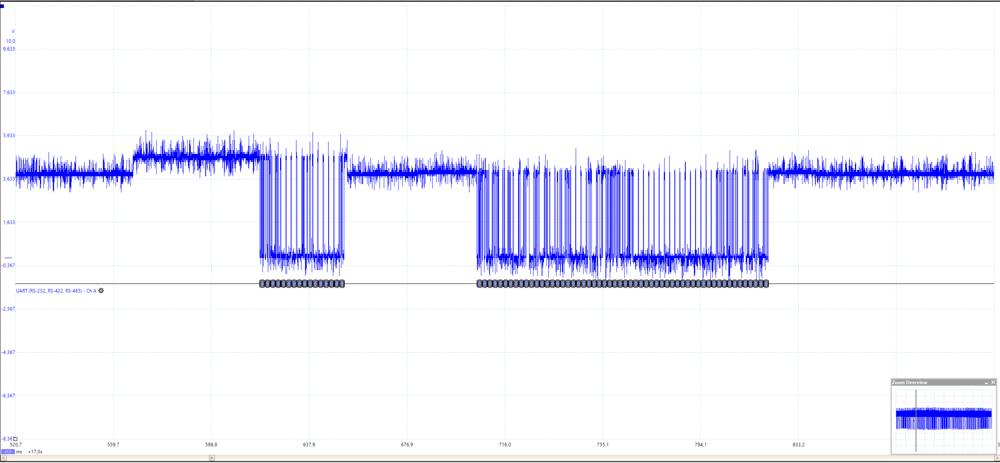
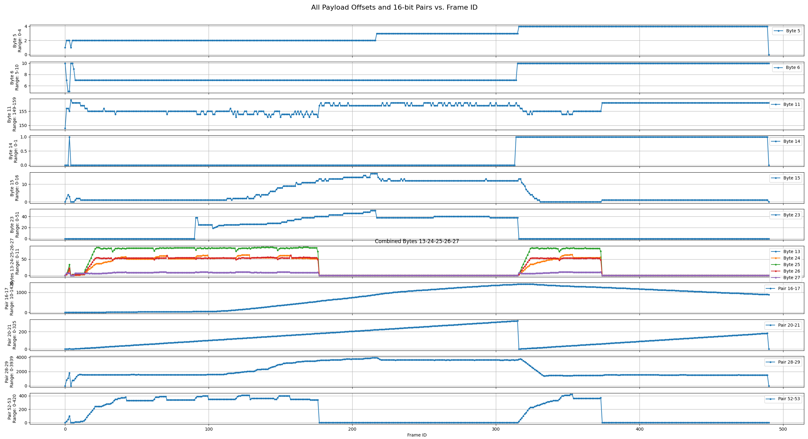

# Vevor Heater Control
Vevor diesel heater control project

I bought a Vevor diesel heater and put it into my workshop with the intention to keep the temperature above zero during winter. There is a project for communication with Chinese heaters, but this broadly used protocol is unfortunately not used in Vevor ones. Because there was no solution on how to connect Vevor to my Home Assistant ecosystem, I needed to do it by myself.

## 2. Current Status of the Project
The project is now ready to use for all who have some experience with ESPHome. 

### 2.1 HW
This is a simple schematic of how I connected my ESP32 to the bus. \
Be careful and connect the RX transistor to the 3.3V rail, not 5V. \
**Double check the transistors'** pinout. \
Feel free to use any pin for TX and RX. \
**Put pullup resistor between data line and 5V**



### 2.2 SW

1. Open terminal in project folder
```
firmware/esphome/vevor_heater_example
```

2. Install the ESPHome library using pip
```
pip install esphome
```
3. Change the config RNW-ESPHM-C3-MNM-VEVOR/RNW-ESPHM-C3-MNM-VEVOR.yaml to match your board configuration and just run it using this command
```bash
esphome run vevor_heater_example
```


The project for my board is located in the folder firmware/esphome/RNW-ESPHOME-C3-MNM-VEVOR. There are more settings than you need and no temperature sensor. Add one if you want to. 




A more easy-to-use solution is in the "work in progress" state. I will try to get to it soon. 

## 4. Hardware background
The bus is open drain. The basic voltage is approximately 4V and very noisy (3.3 - 6V). Don't connect directly to any MCU without protection; there is a risk that the magic smoke will escape...

Captured communication looks like this:


The hardware seems to be very similar to that described by [Ray Jones](https://gitlab.com/mrjones.id.au/bluetoothheater/-/blob/master/Documentation/V9%20-%20Hacking%20the%20Chinese%20Diesel%20Heater%20Communications%20Protocol.pdf?ref_type=heads)
Half-duplex communication using NPN, PNP transistors and an EN pin driving them. 
The CPU in the Vevor controller is most likely 5V tolerant, unlike our ESP32. I created a simple circuit for safe connection between the Vevor bus and my ESP32.

## 5. Software
The controller sends a command to the main unit every second. The unit sends back the current status.
Baud rate is 4.8 kbaud.

### 5.1 Communication Controller -> Main Unit
| Byte  | Certainty | Values     | Comment
| ---   | ---       | ---        | ---
| 0:    | 100%      | 0xAA       | Identifier 0xAA
| 1:    | 100%      | 0x66       | Device ID (controller 0x66, heater 0x77)
| 2:    | 50%       | 0x02 0x06  | Command? (0x02: get state, 0x06: start up)
| 3:    | 100%      | 0x0B       | Length field (0x0B for controller->heater, 0x33 for heater->controller)
| 4:    | 0%        | 0x00       | Unknown
| 5:    | 0%        | 0x00       | Unknown
| 6:    | 0%        | 0x00       | Unknown
| 7:    | 0%        | 0x00       | Unknown
| 8:    | 100%      | 1-10       | Power level [level]
| 9:    | 90%       | 2, 6, 8    | Requested state (0x02: off, 0x06: start, 0x08: running) [state]
| 10:   | 0%        | 0x00       | Unknown
| 11:   | 0%        | 0x00       | Unknown
| 12:   | 0%        | 0x00       | Unknown
| 13:   | 0%        | 0x00       | Unknown
| 14:   | 100%      | 1-255      | Checksum

### 5.2 Communication Main Unit -> Controller
| Byte  | Certainty | Values     | Comment
| ---   | ---       | ---        | ---
| 0:    | 100%      | 0xAA       | Identifier 0xAA
| 1:    | 100%      | 0x77       | Device ID (controller 0x66, heater 0x77)
| 2:    | 50%       | 0x02       | Command?
| 3:    | 100%      | 0x33       | Length field (0x0B for controller->heater, 0x33 for heater->controller)
| 4:    | 80%       | 0-1        | All 1, last one 0 | Heater enabled?
| 5:    | 99%       | 0x00-0x04  | State (0x00: off, 0x01: glow plug pre-heat, 0x02: ignited, 0x03: stable combustion, 0x04: stopping, cooling) [state]
| 6:    | 100%      | 0x01-0x0A  | Power level [level]
| 7:    | 0%        | 0x00       | Unknown
| 8:    | 0%        | 0x00, 0x03 | 0x03 if running, 0x00 if stopped (just last one is 0)
| 9:    | 0%        | 0x00, 0xFB | 0xFB if running, 0x00 if stopped (just last one is 0)
| 10:   | 0%        | 0x00       | Unknown
| 11:   | 99%       | 153-158    | Input voltage [V * 10]
| 12:   | 0%        | 0x00       | Unknown
| 13:   | 40%       | 0-12       | Glow plug current [A]
| 14:   | 50%       | 0-1        | Cooling down [0/1]
| 15:   | 30%       | 0-16       | Fan voltage? Some temperature? [V]
| 16-17:| 99%       | 480,1630   | Heat exchanger temperature [°C * 100]
| 18:   | 0%        | 0x00       | Unknown
| 19:   | 0%        | 0x00       | Unknown
| 20-21:| 90%       | 0-325      | State duration [s]
| 22:   | 0%        | 0x00       | Unknown
| 23:   | 90%       | 0-51       | Pump frequency [Hz*10]
| 24:   | 25%       | 0-66       | Glow plug voltage/current/temperature
| 25:   | 25%       | 0-86       | Glow plug voltage/current/temperature
| 26:   | 25%       | 0-56       | Glow plug voltage/current/temperature
| 27:   | 25%       | 0-12       | Glow plug voltage/current/temperature
| 28-29:| 90%       | 0-3939     | Fan speed [rpm]
| 30-45:| 0%        | 0x00       | Unknown
| 46:   | 0%        | 35         | Unknown constant
| 47:   | 0%        | 4          | Unknown constant
| 48:   | 0%        | 17         | Unknown constant
| 49:   | 0%        | 35         | Unknown constant
| 50:   | 0%        | 0x00       | Unknown
| 51:   | 0%        | 30, 40     | Unknown
| 52-53:| 10%       | 0-420      | Something glow plug related
| 54:   | 0%        | 0x00       | Unknown
| 55:   | 100%      | 1-254      | Checksum

### 5.2.3. Plot
Use the Python script software/plot_frame.py to visualize values in the frame. You can just run it; the needed data are included in docs. It looks like this:



## 6. Help needed
A couple of things are missing: 
- altitude compensation
  - should be kind of easy to get from the frame. I have no motivation to do it now :-D
- error reading
  - complicated for me because my device works just fine and I don't want to cause errors. Nevertheless, at least some of them should be easy to get (low battery voltage...?). If someone does it, please let me know and I will implement it.
- device compatibility
  - I have no idea if all Vevor heaters use the same protocol. There is a new generation of Vevor diesel heaters with CO measurement. If someone has it and has tried it, let me know if it works.

Anyway, feel free to make "pull requests" for anything you add to the code please.  

## 7. Ready to Use Device
In case there would be interest in the units which could be used as replacements for basic ones, I am open to this option. But even if I don't need to earn money on this, the units would be comparable in price to the whole diesel heater. But if approximately 60 USD + shipping would make sense for you, feel free to contact me or join the project.

Edit 22.10.2025: There were a couple of requests for that. I will try to produce a batch of ~20 pieces in the second half of November. But my plans are rarely going according to plan.  
If I manage, I will add a small display, temperature sensor, buttons, and low power mode.

j.meindl@seznam.cz